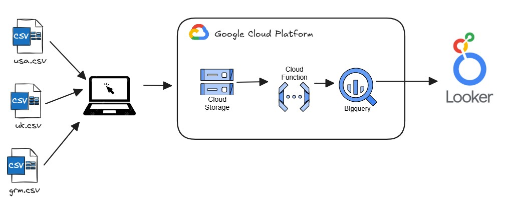
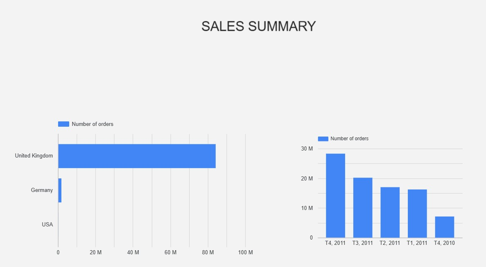

#  ETL en Google Cloud Platform (GCP)

### **Carga de CSV → Cloud Storage → Cloud Function → BigQuery → Looker**

Este proyecto implementa un flujo ETL serverless utilizando servicios
nativos de Google Cloud Platform. El objetivo es cargar archivos CSV
provenientes de distintas fuentes (usa.csv, uk.csv, grm.csv),
procesarlos automáticamente y habilitar su análisis desde Looker.

##  Arquitectura General

1.  Carga manual de archivos CSV desde web hecha con flask.
2.  Cloud Storage recibe los archivos.
3.  Cloud Function procesa automáticamente cada carga.
4.  BigQuery almacena los datos procesados.
5.  Looker visualiza y explora los datos.

##  Archivos de entrada

-   `usa.csv`
-   `uk.csv`
-   `grm.csv`

Tomados de dataset e-commerce data de kaggle.

##  Componentes del Pipeline

###  Cloud Storage

Bucket para recibir archivos y activar la Cloud Function.

###  Cloud Function

Responsable de: - Detectar cargas nuevas. - Leer y transformar los
CSV. - Cargar datos hacia BigQuery.

###  BigQuery

Data Warehouse donde reside la tabla analítica.El dataset es 'Sales' y la table 'orders'

###  Looker

BI conectado a BigQuery para dashboards y análisis.

##  Flujo Completo

1.  Subida de CSV a Cloud Storage.\
2.  Trigger → Cloud Function.\
3.  Transformación y carga hacia BigQuery.\
4.  Consumo desde Looker.

## Estructura del Proyecto

    /gcp-etl-salesdata
    │
    ├── cloud-function/
    │   ├── main.py
    │   ├── requirements.txt
    │
    ├── docs/
    │   └── arquitectura.png
    │
    ├── bigquery/
    │   └── create_views.sql
    │
    ├── templates/
    │   └── index.html
    │
    └── README.md

